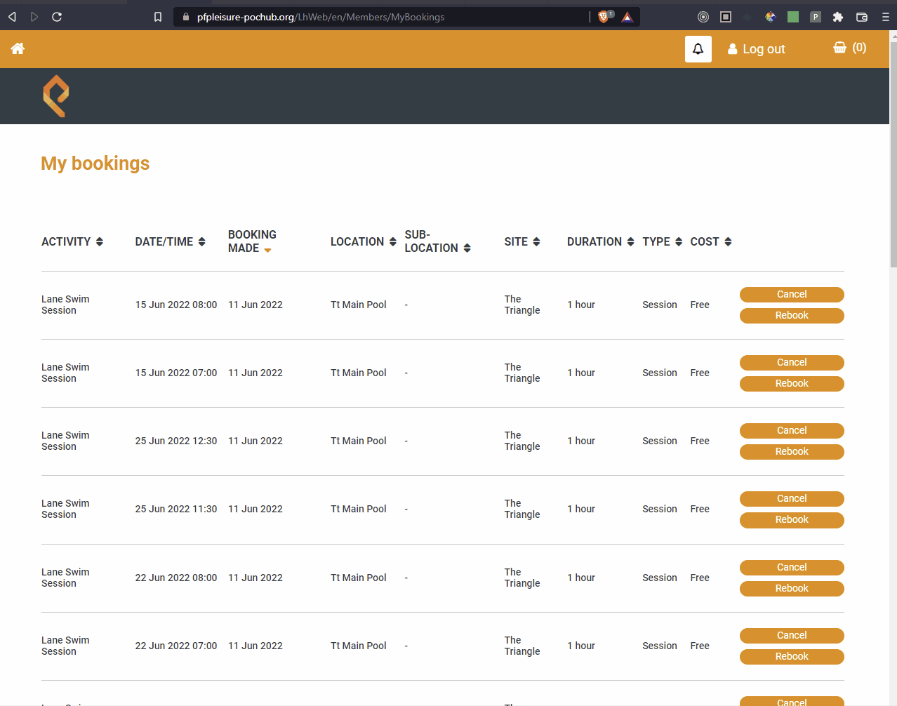

# Places Leisure Chrome Extension

## What is it?

My local swimming pool's website doesn't show your bookings in the calendar view and by default displays bookings in filtered by booking date, I decided to change that. This simple chrome extension will quickly generate a calendar view on top of the website listing all of your bookings for the current month with the option to add a Google Calendar event.

## How can I use it?

1. Clone this repository
2. Follow this [official guide]("https://developer.chrome.com/docs/extensions/mv3/getstarted/#unpacked") from Google Developer Documentation.

## See it in action
